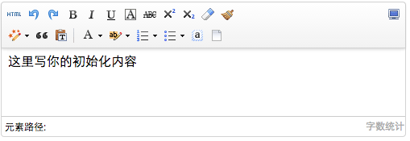

# 定制工具栏图标

ueditor工具栏上的按钮列表可以自定义配置,只需要通过修改配置项就可以实现需求

## 配置项修改说明

修改配置项的方法：
1. 方法一：修改ueditorconfig.js里面的toolbars
2. 方法二：实例化编辑器的时候传入toolbars参数
```javascript
var ue = UE.getEditor('container');
```

其他配置项：[1.4 配置项说明.md](1.4 前端配置项说明.md)

## 简单列表

```javascript
toolbars: [['fullscreen', 'source', 'undo', 'redo', 'bold']]
```

## 多行列表

```javascript
toolbars: [
    ['fullscreen', 'source', 'undo', 'redo'],
    ['bold', 'italic', 'underline', 'fontborder', 'strikethrough', 'superscript', 'subscript', 'removeformat', 'formatmatch', 'autotypeset', 'blockquote', 'pasteplain', '|', 'forecolor', 'backcolor', 'insertorderedlist', 'insertunorderedlist', 'selectall', 'cleardoc']
]
```

两行的例子:


## 工具栏按钮分割线

配置项里用竖线 '|' 代表分割线

## 完整的按钮列表

```javascript
toolbars: [[
    'anchor', //锚点
    'undo', //撤销
    'redo', //重做
    'bold', //加粗
    'indent', //首行缩进
    'snapscreen', //截图
    'italic', //斜体
    'underline', //下划线
    'strikethrough', //删除线
    'subscript', //下标
    'fontborder', //字符边框
    'superscript', //上标
    'formatmatch', //格式刷
    'source', //源代码
    'blockquote', //引用
    'pasteplain', //纯文本粘贴模式
    'selectall', //全选
    'print', //打印
    'preview', //预览
    'horizontal', //分隔线
    'removeformat', //清除格式
    'time', //时间
    'date', //日期
    'unlink', //取消链接
    'insertrow', //前插入行
    'insertcol', //前插入列
    'mergeright', //右合并单元格
    'mergedown', //下合并单元格
    'deleterow', //删除行
    'deletecol', //删除列
    'splittorows', //拆分成行
    'splittocols', //拆分成列
    'splittocells', //完全拆分单元格
    'deletecaption', //删除表格标题
    'inserttitle', //插入标题
    'mergecells', //合并多个单元格
    'deletetable', //删除表格
    'cleardoc', //清空文档
    'insertparagraphbeforetable', //"表格前插入行"
    'insertcode', //代码语言
    'fontfamily', //字体
    'fontsize', //字号
    'paragraph', //段落格式
    'simpleupload', //单图上传
    'insertimage', //多图上传
    'edittable', //表格属性
    'edittd', //单元格属性
    'link', //超链接
    'emotion', //表情
    'spechars', //特殊字符
    'searchreplace', //查询替换
    'map', //Baidu地图
    'gmap', //Google地图
    'insertvideo', //视频
    'help', //帮助
    'justifyleft', //居左对齐
    'justifyright', //居右对齐
    'justifycenter', //居中对齐
    'justifyjustify', //两端对齐
    'forecolor', //字体颜色
    'backcolor', //背景色
    'insertorderedlist', //有序列表
    'insertunorderedlist', //无序列表
    'fullscreen', //全屏
    'directionalityltr', //从左向右输入
    'directionalityrtl', //从右向左输入
    'rowspacingtop', //段前距
    'rowspacingbottom', //段后距
    'pagebreak', //分页
    'insertframe', //插入Iframe
    'imagenone', //默认
    'imageleft', //左浮动
    'imageright', //右浮动
    'attachment', //附件
    'imagecenter', //居中
    'wordimage', //图片转存
    'lineheight', //行间距
    'edittip ', //编辑提示
    'customstyle', //自定义标题
    'autotypeset', //自动排版
    'webapp', //百度应用
    'touppercase', //字母大写
    'tolowercase', //字母小写
    'background', //背景
    'template', //模板
    'scrawl', //涂鸦
    'music', //音乐
    'inserttable', //插入表格
    'drafts', // 从草稿箱加载
    'charts', // 图表
]]
```
