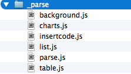

# 编辑内容展示

##背景
大家使用ueditor是为了让用户能在页面中编辑富文本内容，但这应该只是手段方法。我们最终的目的是为了呈现用户编辑的内容。也就是内容的展示。原来我们对这块是不考虑的，只关注在编辑端。但随着编辑器产出内容的增加和复杂化，比如图表展示，代码高亮，自定义的列表标号等等，如果都在最终产出的编辑数据中处理，那势必会导致产出数据带有冗余内容，而且也很大程度上硬编码了展示时定制效果。基于这些问题，**uparse**产生了。

## uparse的定义 
基于js的实现机制，在展示页面中，对ueditor的产出的编辑数据，进行解析和转换，以呈现不同的效果。为后边的多端（移动端和pc端）展示打下基础。

##uparse的作用
它会根据内容展示内容，动态的在你的展示页中加入css代码,比如你的编辑数据中有表格，那就会加入一些表格的css样式,如果有图表数据，会调用相关的js插件，解析数据成为图表等。

## uparse的使用

1. 在下载包中找到ueditor.parse.js或者uparse.js(这两个没有区别，就是版本不同，功能是一致的).完整版本的包中，ueditor.parse.js是没有打包编译的，需要进行编译，编译相关的请看编译文档。从1.3.5开始，uparse做了重构，将原来的一个文件拆解成了多个插件形式的js,为了适应越来越多的功能需求。 parse.js是核心文件，定了插件的管理机制和一些快捷方法，感兴趣的同学可以看一下。其他文件代表的一种数据解析功能，比如insertcode.js是针对的数据里边的代码进行展示时的解析等等。看到这里，大家应该能想到，uparse是需要依赖ueditor项目中的third-party中先关的第三方库的。
2. 根据你的路径加载uparse.js
```html
<head>
    <meta http-equiv="Content-Type" content="text/html;charset=utf-8"/>
    <script src="../ueditor.parse.js"></script>
    <title></title>
</head>
```将uparse.js记载到页面，不同目录结构，路径不同.

3. 当加载了uparse.js后，就可以调用uParse这个函数，执行内容解析了。
```javascript
   //uParse的语法
   //uParse(cssSelector,[options])
```cssSelector，是告诉uParse你将编辑数据放到那个容器里了，比如你放到一个div里```html <div id="content"><p>dsfsdF</p><p>sdsdf</p></div>```cssSelector就是#content,现在支持3种格式,tag,id,class.也就是你可以渲染页面中多个地方。options是个json对象。基于1.3.5版本，可配置的参数。
```javascript
{rootPath:'', //ueditor所在的路径，这个要给出，让uparse能找到third-party目录
  //因为需要引入目录下的那些js文件，当然会根据你的编辑数据，按需加载
  liiconpath : 'http://bs.baidu.com/listicon/', //自定义列表标号图片的地址，默认是这个地址
  listDefaultPaddingLeft : '20'//自定义列表标号与文字的横向间距
}   
```一般只要给个rootPath就够了，其他的都可以使用默认值。一般在页面底部加入如下代码
```javascript
 uParse('.content',{
            rootPath : '../'
        })```这个表示对于className是content的容器里边的内容进行解析。
        
##小结
我们是建议用户使用uparse来解析展示页中的数据的，当然你也可以给出自己针对某些标签的自定义样式，这个跟uparse是不冲突的.随着可编辑内容的丰富和复杂，展示数据也会变得越来越复杂和难以维护，而且多端展示的需求也越来越强烈。展现数据会变得需要做更多的事情。欢迎大家跟我们进行探讨。
        