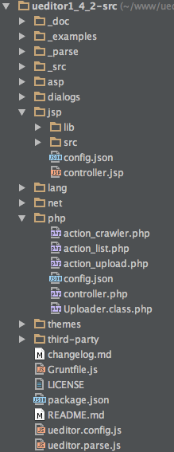

# 目录说明

## 部署版本目录说明

ueditor下载包有两个类型: 源码包 和 部署包

源码包包含了ueditor的源码、各后台的代码和使用的例子

### 1. 部署包目录说明

部署包解压后的文件目录结构如下所示

* **dialogs**: 弹出对话框对应的资源和JS文件
* **lang**: 编辑器国际化显示的文件
* **php或jsp或asp或net**: 涉及到服务器端操作的后台文件
* **themes**: 样式图片和样式文件
* **third-party**: 第三方插件(包括代码高亮，源码编辑等组件）
* **ueditor.all.js**: 开发版代码合并的结果,目录下所有文件的打包文件
* **ueditor.all.min.js**: ueditor.all.js文件的压缩版，建议在正式部署时采用
* **ueditor.config.js**: 编辑器的配置文件，建议和编辑器实例化页面置于同一目录
* **ueditor.parse.js**: 编辑的内容显示页面引用，会自动加载表格、列表、代码高亮等样式,具体看[内容展示文档](1.3 编辑内容展示.md)
* **ueditor.parse.min.js**: ueditor.parse.js文件的压缩版，建议在内容展示页正式部署时采用

### 2. 源码包目录说明

源码包解压后的文件目录结构如下所示

源码包部分目录和文件与部署包名称一致,用途也会是一致,具体说明如下:

* **\_doc**: 部分markdown格式的文档
* **\_example**: ueditor的使用例子
* **\_parse**: ueditor.parse.js的源码,parse的用途具体看[内容展示文档](1.3 编辑内容展示.md)
* **\_src**: ueditor.all.js的源码,打包方法看[grunt打包文档](4.2 使用grunt打包源代码.md)
    * **\_src\core**: ueditor核心代码
    * **\_src\plugins**: 插件文件
    * **\_src\ui**: ui相关文件
    * **\_src\adapter**: 桥接层文件,对接ueditor核心和ui代码
* **php**: php后台文件的目录
    * **php\config.json**: 后端配置文件,所有前后端相关配置项,都放在这里
    * **php\controller.php**: 接收所有请求的接口文件,通过它判断action参数,分发具体任务给其他php文件
    * **php\action_crawler**: 撞去远程文件的代码,转存文件使用
    * **php\action_upload**: 上传图片、附件、视频的处理代码
    * **php\action_list**: 列出在线的图片或者是附件
    * **php\Upload.class.php**: 上传文件使用的类
* **jsp**: jsp后台文件的目录
    * **jsp\config.json**: 后端配置文件,所有前后端相关配置项,都放在这里
    * **jsp\controoler.jsp**: 接收所有请求的接口文件
    * **jsp\lib**: 所有用到的jar包,其中的ueditor-\*.jar包是ueditor所有后台相关处理逻辑的工具
    * **jsp\src**: lib里面的uedior-\*jar文件的java源码
* **asp**: asp后台文件的目录
* **net**: .net后台文件的目录
* **dialogs**: 同部署包说明
* **lang**: 同部署包说明
* **themes**: 同部署包说明
* **third-party**: 同部署包说明
* **changelog.md**: 各版本的ueditor更新记录
* **Gruntfile.js**: grunt执行的任务文件,用来把源码包打包成部署版本,打包方法看[grunt打包文档](4.2 使用grunt打包源代码.md)
* **LICENSE**: 开源协议说明证书,ueditor使用MIT开源协议
* **ueditor.config.js**: 前端配置文件
* **ueditor.parse.js**: 还没合并时使用的parse文件,会自动加载_parse里面的文件
