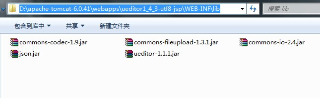
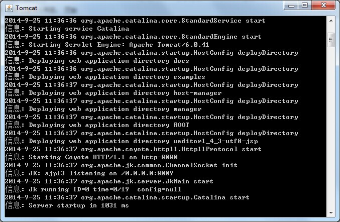
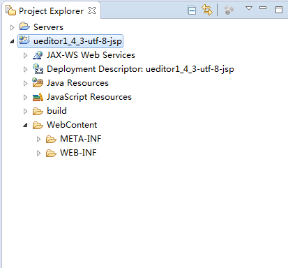
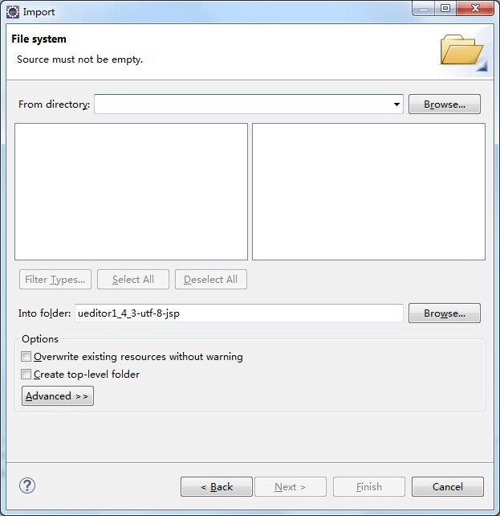
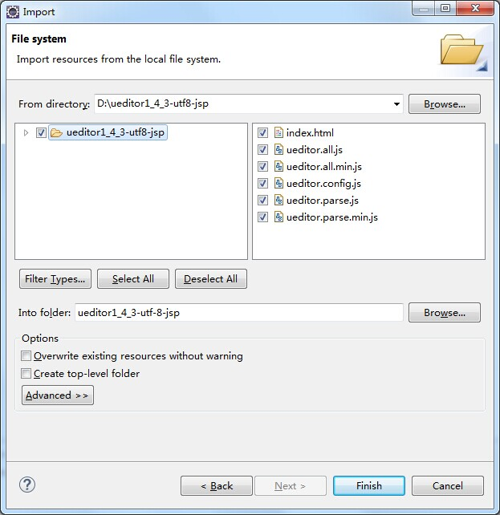
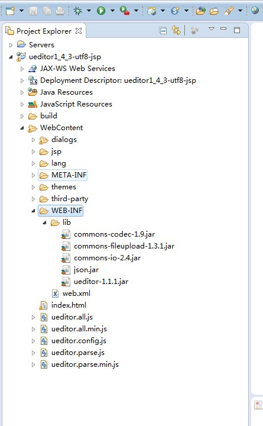
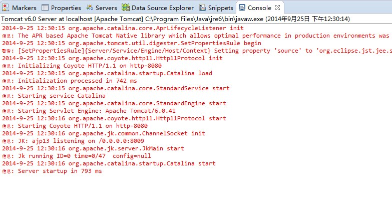
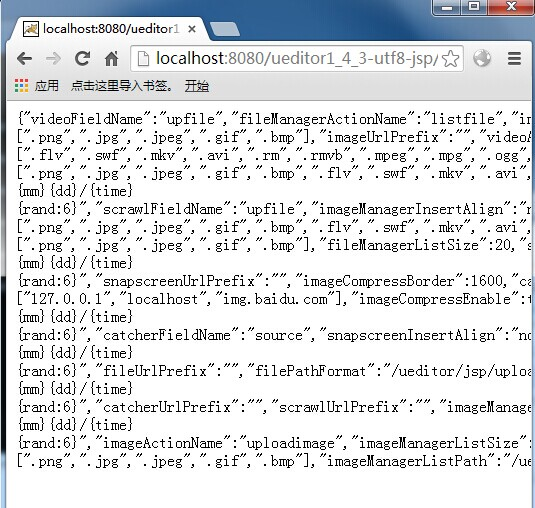

JSP 使用说明
===

## 1 背景

UEditor 1.4.0 版本对之前的配置方式进行了简化，具体请参见：[后端请求规范](3.3 后端请求规范.md)，为了适应这次升级，JAVA 后台也进行了重写，跟之前的版本差别较大，升级的用户注意阅读本文档。

本文档介绍 UEditor JAVA 后台的部署和配置说明。

**注意：本文档仅适用于1.4.0之后的Java版UEditor。**


## 2 先决条件
1. JDK 1.6+
2. Apache Tomcat 6.0+
3. UEditor 1.4.0+

## 3 示例环境

### 3.1 软件版本信息
1. JDK 6u45
2. Tomcat 6.0.41
3. UEditor 1.4.3 UTF-8 Java版
4. OS: Windows7 Ultimate SP1 X64
5. Eclipse 4.4.0

### 3.2 软件路径信息
1. Tomcat 安装路径：
```
D:\apache-tomcat-6.0.41\
```

## 4 部署

### 4.1 手动部署

1. 解压对应的UEditor压缩包至Tomcat的webapps目录下，最终，UEditor的安装路径为：
```
D:\apache-tomcat-6.0.41\webapps\ueditor1_4_3-utf8-jsp\
```

2. 进入目录：
```
D:\apache-tomcat-6.0.41\webapps\ueditor1_4_3-utf8-jsp\
```
创建如下两个文件夹（注意区分大小写）：
```
WEB-INF\lib\
```

3. 拷贝目录：
```
D:\apache-tomcat-6.0.41\webapps\ueditor1_4_3-utf8-jsp\jsp\lib\
```
下的所有jar包到第2步创建的lib目录下，结果如图所示：


4. 部署完成，双击以下脚本文件，启动Tomcat（需要正确配置JAVA_HOME环境变量）。
```
D:\apache-tomcat-6.0.41\bin\startup.bat
```
出现如下所示界面，则表示服务器启动成功。


5. 进入**5 验证安装**步骤，验证部署是否成功。

### 4.2 Eclipse部署

1. 在Eclipse中配置Tomcat 6.0。

2. 在Eclipse中创建一个名为
```
ueditor1_4_3-utf8-jsp
```
的“Dynamic Web Project”项目。如下图所示：


3. 解压下载的UEditor包到D盘根目录。

4. 在Eclipse中的项目
```
ueditor1_4_3-utf8-jsp
```
下的“WebContent”目录上右击，在弹出的菜单中选择：Import->Import...，弹出如下图所示对话框：


5. 在弹出的对话框中展开General项，双击“File System”后弹出对话框，如下图所示：


6. 点击“Browse...”按钮，在弹出的文件选择对话框中选中第3步中解压出来的ueditor文件夹，并勾选全部文件，结果如下图所示：


7. 点击“Finish”按钮，完成导入。

8. 拷贝目录**jsp/lib/**下的所有jar包到**WEB-INF/lib/**目录下， 部署至此完成，最终项目的结构如下图所示：


9. 添加该项目到Tomcat中，并启动Tomcat，在Eclipse的“Console”面板中出现如下图所示的界面时，启动成功。


10. 进入**5 验证安装**步骤，验证部署是否成功。

## 5 验证安装

在浏览器地址栏中输入如下URL：
```
http://localhost:8080/ueditor1_4_3-utf8-jsp/jsp/controller.jsp?action=config
```
出现类似下图所示内容，则配置成功，否则，即为失败。

