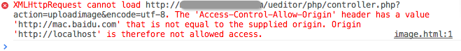
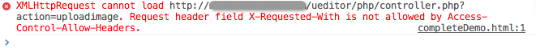

# 跨域支持说明

前端和后端不在同域的情况下，ueditor很多功能需要跨域设置才能正常执行。

## 跨域的例子

只要两个路径的 协议、域名、端口，其中一个不相同，两个路径间的请求就是跨域请求，以下都是跨域的例子：

1. ueditor的页面在 http://a.com 下，serverUrl指向域名在 http://b.com 域下
2. ueditor的页面在 http://a.com 下，serverUrl指向域名在 http://a.b.com 域下
3. ueditor的页面在 http://a.com 下，serverUrl指向域名在 http://a.com:8080 域下
4. ueditor的页面在 http://a.com 下，serverUrl指向域名在 https://a.com 域下

## ueditor各种请求的跨域解决方案

ueditor有三类请求方式，Ajax GET请求，Ajax POST请求，flash上传请求，表单上传请求

### 1. Ajax GET请求

相关请求：

1. ueditor获取config的请求
2. 远程图片转存的请求
3. 列出在线图片或附件请求

UE.ajax工具新增了jsonp的请求方式和getJSONP方法，ueditor的多个请求，会判断serverUrl路径是否跨域，如果是跨域，使用jsonp的请求方。由于后端有对jsonp请求做支持，它们可以正常完成请求。

utils里新增了判断跨域的方法，可以传入路径判断是否与当前域名行程跨域关系。
```javascript
//当前页面是http://localhost下,那么
utils.isCrossDomain('./php/controller.php'); //相对路径不跨域，返回false
utils.isCrossDomain('/ueditor/php/controller.php'); //根路径跨域，返回false
utils.isCrossDomain('https://a.com:8080/php/controller.php'); //返回true
```

通过UE.ajax.getJSONP发送请求：
```javascript
UE.ajax.getJSONP('./php/controller.php', {key1: 'value1', key2: 'value2'}, function(r) {
    console.log(r);
);
```

### 2. Ajax POST请求

相关请求：

1. 多图上传、上传附件、上传视频在支持html5上传的浏览器下使用时
2. 粘贴板图片上传、拖放图片上传
3. 涂鸦上传

ueditor的dialogs主要使用[webuploader](http://fex.baidu.com/webuploader)做上传请求。默认情况下，使用webuploader时，如果浏览器支持html5上传，会使用html5的形式上传，否则使用flash上传。

跨域情况下，使用html5上传，会有一个提示：

这个时候需要在后端设置允许跨域的header，php设置方式如下：
```php
header("Access-Control-Allow-Origin: http://a.com"); // 允许a.com发起的跨域请求
//如果需要设置允许所有域名发起的跨域请求，可以使用通配符 *
header("Access-Control-Allow-Origin: *"); // 允许任意域名发起的跨域请求
```

做了以上的修改之后，有一些请求还是会出错，例如下面这种，某些header属性不支持跨域：

解决这个错误，需要在后端设置允许跨域的header属性，php设置方式如下：
```php
header('Access-Control-Allow-Headers: X-Requested-With');
```

### 3. flash上传请求

相关请求：

1. 多图上传、上传附件、上传视频在不支持html5上传的浏览器下使用时
2. word图片上传

webuploader在不支持html5的浏览器下，通过flash完成上传，假如希望webuploader在支持html5的浏览器下也使用flash上传，可以修改dialogs里面的页面，把引用webuploader的js换成 webuploader.flashonly.js 路径。

解决flash跨域错误，需要在目标域名的根目录下防止crossdomain.xml文件，里面定义允许发起跨域请求的域名。xml例子设置如下：
```xml
<?xml version="1.0"?>
<cross-domain-policy>
<allow-access-from domain="www.baidu.com" />
<allow-access-from domain="*.baidu.com" />
<allow-access-from domain="192.168.0.101" />
</cross-domain-policy>
```

### 4. 表单上传请求

相关请求：单图上传

单图上传暂时不支持跨域设置，为了兼容低版本浏览器，使用了提交表单到iframe提交。通过iframe的onload事件，触发回调函数，这时候再读取iframe里面的内容，得到的服务器返回数据。
跨域情况下，产生了跨域的iframe访问，可以解决方法都需要前后端一起改变。要解决这个问题，小伙伴们发挥想象力吧。

> 对跨域设置有建议和更好的方案可以到在这里讨论：[issues 205]([https://github.com/fex-team/ueditor/issues/205)
