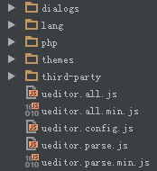

# 部署编辑器

## 编辑器目录说明

1. 到官网下载ueditor最新版: [官网地址](http://ueditor.baidu.com/website/download.html#ueditor "ueditor官网地址")

2. 解压后的文件目录结构如下所示

	

3. 目录和文件说明:

	* dialogs：弹出对话框对应的资源和JS文件
	* lang：编辑器国际化显示的文件
	* php或jsp或net：涉及到服务器端操作的后台文件
	* themes：样式图片和样式文件
	* third-party：第三方插件(包括代码高亮，源码编辑等组件）
	* ueditor.all.js：开发版代码合并的结果,目录下所有文件的打包文件
	* ueditor.all.min.js：ueditor.all.js文件的压缩版，建议在正式部署时采用
	* ueditor.config.js：编辑器的配置文件，建议和编辑器实例化页面置于同一目录
	* ueditor.parse.js：编辑的内容显示页面引用，会自动加载表格、列表、代码高亮等样式
	* ueditor.all.min.js：ueditor.parse.js文件的压缩版，建议在内容展示页正式部署时采用

4. 在你页面head内，引用ueditor文件、配置文件和语言包文件。插入下面的代码，修改引用路文件的路径。

	```html
		<!-- 配置文件 -->
		<script type="text/javascript" src="./ueditor/ueditor.config.js"></script>
		<!-- 编辑器源码文件 -->
		<script type="text/javascript" src="./ueditor/ueditor.all.js"></script>
		<!-- 语言包文件(建议手动加在语言，避免在ie下有时因为加载语言失败导致编辑器加载失败) -->
		<script type="text/javascript" src="./ueditor/lang/zh-cn/zh-cn.js"></script>
	```

5. 然后在代码文件中设置编辑器容器，并添加编辑器的实例化代码。具体代码示例如下。

	```html
		<script id="container" name="content" type="text/plain">这里写你的初始化内容</script>
		<script type="text/javascript">
	    	var editor = UE.getEditor('container')
		</script>
	```

6. 如果看到了下面这样的编辑器，说明已经部署成功！

